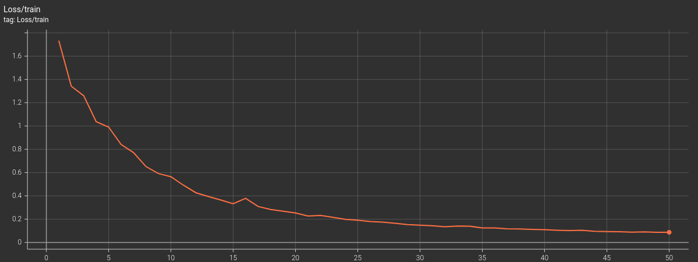
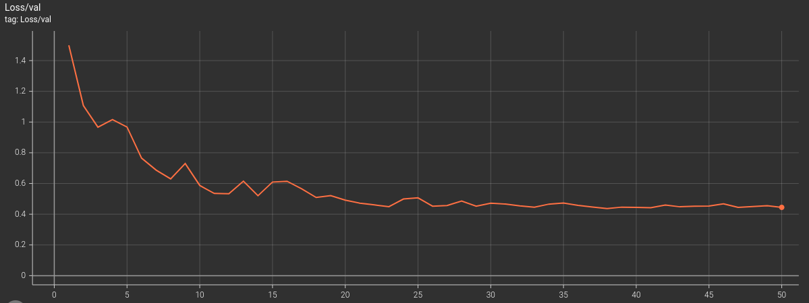
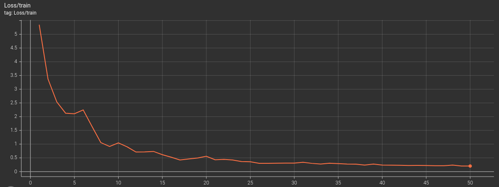
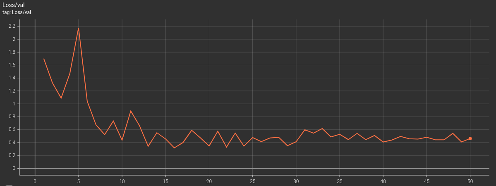

# SAMPN_PyTorch

This is a torn down version of the original SAMPN repository (found [here](https://github.com/tbwxmu/SAMPN)).

## Training
To train a model:
```bash
usage: train.py [-h] [--epochs EPOCHS] [--batch-size BATCH_SIZE]
                [--warmup-epochs WARMUP_EPOCHS] [--dataset DATASET]

Train a model on a dataset.

optional arguments:
  -h, --help            show this help message and exit
  --epochs EPOCHS       Number of epochs to train.
  --batch-size BATCH_SIZE
                        Batch size.
  --warmup-epochs WARMUP_EPOCHS
                        Number of epochs to warmup.
  --dataset DATASET     Dataset type (lipophilicity or solubility).
```

Our training results on lipophilicity:





Our training results on aqueous solubility:





## Testing
To test a model:
```bash
usage: test.py [-h] [--batch-size BATCH_SIZE] [--dataset DATASET] [--model MODEL]
               [--weights WEIGHTS] [--iterations ITERATIONS]

Test a model on a dataset.

optional arguments:
  -h, --help            show this help message and exit
  --batch-size BATCH_SIZE
                        Batch size.
  --dataset DATASET     Dataset type (lipophilicity or solubility).
  --model MODEL         Model type (QSAR or QSARPlus).
  --weights WEIGHTS     Path to the model weights.
  --iterations ITERATIONS
                        Number of iterations to run.
```

Our test results on lipophilicity:

```bash
$ python3 test.py --dataset lipophilicity --weights ./checkpoint/lipophilicity/model_state_dict.pt
rmse       0.2979
mae        0.2188
mse        0.0894
r2         0.9211
pearson    0.9636
```

Our test results on aqueous solubility:
```bash
$ python3 test.py --dataset solubility --weights ./checkpoint/solubility/model_state_dict.pt
rmse       0.7650
mae        0.6428
mse        0.5932
r2         0.2540
pearson    0.7287
```